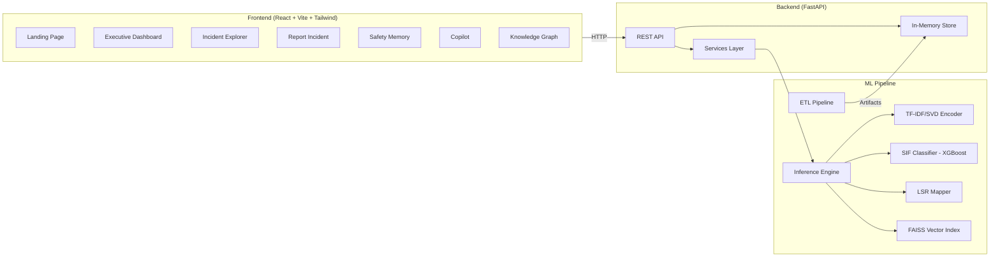
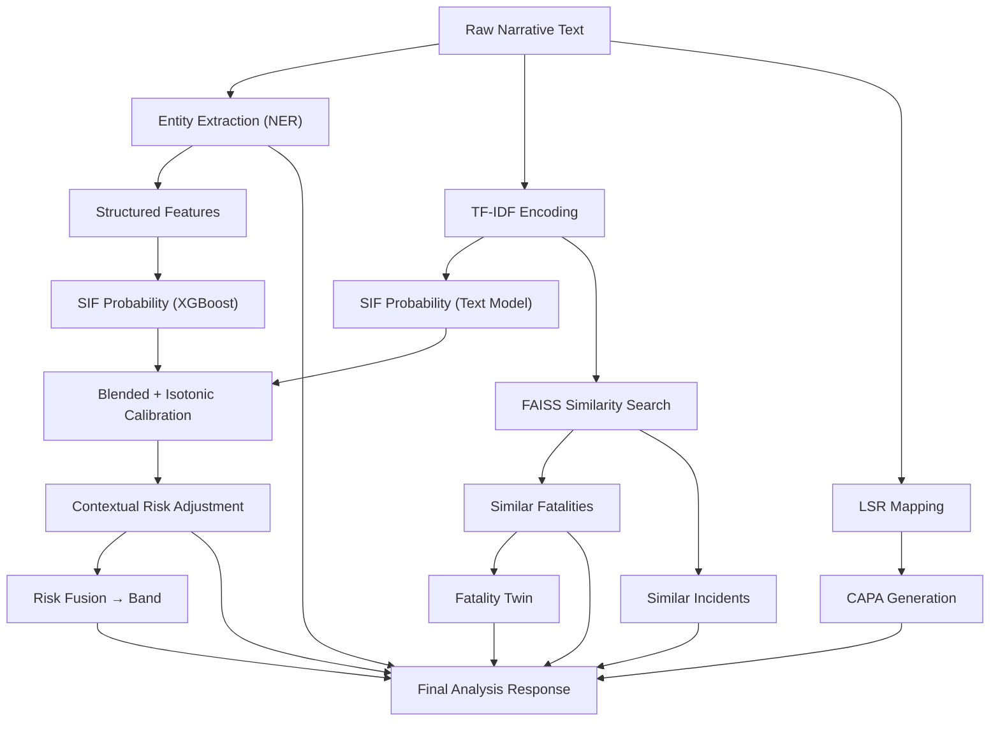

# KAVACH AI — Complete Project Explanation

> **Knowledge-driven AI for Vigilance and Critical Hazard Prevention**
> Smart India Hackathon 2026 · Team The Last Commit · Problem Domain: Industrial Safety (Oil India Limited)

---

## 🎯 What This Project Does

KAVACH AI is an **AI-powered industrial safety intelligence platform** that reads free-text safety incident reports and transforms them into **structured, scored, explainable, and actionable intelligence**. It's built on **two real OSHA datasets** (~16,249 records total: 4,847 incidents + 14,914 fatalities).

### The Core Problem It Solves

In industrial settings (oil rigs, refineries, pipelines):
1. **Reports are reviewed in isolation** — the 4th occurrence of a pattern is investigated like it's the 1st
2. **Severity is recorded, not predicted** — systems capture *what happened*, not *what could have happened*
3. **Nobody can search 15,000 fatalities from memory** — institutional memory is the only link to a past fatal event

> *"Fatal injuries are rarely surprises. They are near misses that nobody read carefully enough."*

---

## 🏗️ Architecture Overview

---

## 🧠 The Two Flagship Capabilities

### 1. Safety Memory — *"An AI that remembers every safety incident ever reported"*

**File:** [`memory.py`](file:///d:/SIH-main/backend/app/services/memory.py)

Every new report is automatically compared against **all 16,249 records** using FAISS vector similarity search. The system answers 3 questions:

| Question | How It's Answered |
|---|---|
| **Has this happened before?** | Ranked matches with real, clickable report IDs and similarity scores |
| **What was the common cause?** | Counted majority across matched set (always shown as "3 of 8" — never as absolute truth) |
| **What should we do about it?** | Precedent-driven action for the Life Saving Rule actually violated |

It also clusters the entire corpus into **recurring patterns** — asking not just "has this happened before?" but "what keeps happening?"

**Verdicts returned:**
- `REPEAT_FATAL_PATTERN` — closely matches cases that ended in fatality (≥55% similarity)
- `REPEAT_PATTERN` — strongly similar non-fatal reports exist
- `RELATED_FATAL_PRECEDENT` — related fatal cases at moderate similarity
- `WEAK_PRECEDENT` — only loosely similar reports
- `NO_PRECEDENT` — genuinely novel event

### 2. Structured Natural-Language Query — *"Ask instead of building a dashboard"*

**File:** [`structured_query.py`](file:///d:/SIH-main/backend/app/services/structured_query.py)

A question like:
> *"Show all confined space incidents during monsoon having SIF > 90 where the gas detector failed"*

carries **4 independent constraints** (hazard class, season, score threshold, failed control) that no filter bar composes. The system:

1. **Parses** it into explicit filters using regex + curated synonym tables
2. **Runs** the filters against the scored corpus
3. **Returns** the aggregate: how many, where most, which control keeps failing
4. **Shows the parsed filter back** — any unparsed clause is reported, not dropped silently
5. **On zero results** — relaxes each constraint in turn and names the binding one

---

## 🔧 ML Pipeline — What Each Component Does

### Data Pipeline ([`ml/pipeline/`](file:///d:/SIH-main/ml/pipeline))

| File | Purpose |
|---|---|
| [`etl.py`](file:///d:/SIH-main/ml/pipeline/etl.py) | Cleans, labels, and splits the two OSHA corpora. Generates synthetic site/area/department metadata (labeled as synthetic in API) |
| [`ner.py`](file:///d:/SIH-main/ml/pipeline/ner.py) | Extracts entities from narratives: hazards, equipment, conditions, activities, failed controls, and barrier failure detection |
| [`embeddings.py`](file:///d:/SIH-main/ml/pipeline/embeddings.py) | Builds TF-IDF + Truncated SVD encoder for narrative text → 768-dim vectors, plus FAISS vector index for similarity search |
| [`inference.py`](file:///d:/SIH-main/ml/pipeline/inference.py) | The single entry point that ties all AI components together for live analysis of a report |

### Models ([`ml/models/`](file:///d:/SIH-main/ml/models))

| File | Purpose |
|---|---|
| [`train_sif_classifier.py`](file:///d:/SIH-main/ml/models/train_sif_classifier.py) | **SIF Classifier** — Blended TF-IDF LogisticRegression (text) + XGBoost (structured features), isotonic calibration. Predicts probability of Serious Injury/Fatality potential |
| [`train_lsr_mapper.py`](file:///d:/SIH-main/ml/models/train_lsr_mapper.py) | **Life Saving Rule Mapper** — Maps incidents to 9 Life Saving Rules (Energy Isolation, Confined Space, Work at Height, etc.) |
| [`risk_fusion.py`](file:///d:/SIH-main/ml/models/risk_fusion.py) | Fuses SIF probability + LSR tags + barrier failure + fatality similarity into a single risk band (CRITICAL/HIGH/MEDIUM/LOW) |
| [`fatality_twin.py`](file:///d:/SIH-main/ml/models/fatality_twin.py) | **Fatality Twin** — Shows the escalation projection: "here's what happened when similar conditions weren't addressed" |
| [`recommendations.py`](file:///d:/SIH-main/ml/models/recommendations.py) | Generates CAPA (Corrective and Preventive Actions) grounded in real precedents |
| [`knowledge_graph.py`](file:///d:/SIH-main/ml/models/knowledge_graph.py) | Builds a knowledge graph of hazard→barrier→consequence relationships using NetworkX; finds which single control, if fixed, breaks the most pathways |
| [`forecaster.py`](file:///d:/SIH-main/ml/models/forecaster.py) | Time-series forecasting of incident volume/risk trends |
| [`pattern_clusters.py`](file:///d:/SIH-main/ml/models/pattern_clusters.py) | K-Means clustering on narrative embeddings to find recurring incident patterns |

### The Inference Flow (What Happens When a Report Is Submitted)

**Key insight:** The inference engine includes a **Contextual Risk Adjustment** layer — the model tends to score everything high (trained on OSHA fatality data), so a post-classifier layer checks whether the narrative contains actual SIF precursors (energized equipment, confined space entry, falls, etc.) vs. routine observations (expired inspection tags, overdue checks). The adjustment is transparent and both scores are exposed.

---

## 🖥️ Frontend Pages (13 Pages)

| Page | Route | What It Shows |
|---|---|---|
| [Landing](file:///d:/SIH-main/frontend/src/pages/Landing.jsx) | `/` | Marketing-style landing with animated stats, feature showcases |
| [Executive Dashboard](file:///d:/SIH-main/frontend/src/pages/ExecutiveDashboard.jsx) | `/dashboard` | KPIs, risk band distribution, site rankings, trend charts |
| [Incident Explorer](file:///d:/SIH-main/frontend/src/pages/IncidentExplorer.jsx) | `/incidents` | Searchable/filterable table of all scored incidents |
| [Incident Detail](file:///d:/SIH-main/frontend/src/pages/IncidentDetail.jsx) | `/incidents/:id` | Full analysis of a single incident with explanation, twin, memory |
| [Report Incident](file:///d:/SIH-main/frontend/src/pages/ReportIncident.jsx) | `/report` | Submit a new incident narrative for live AI analysis |
| [Safety Memory](file:///d:/SIH-main/frontend/src/pages/SafetyMemory.jsx) | `/memory` | Recurring patterns, cluster explorer |
| [Site Intelligence](file:///d:/SIH-main/frontend/src/pages/SiteIntelligence.jsx) | `/sites` | Geospatial heatmap with Leaflet |
| [Area Intelligence](file:///d:/SIH-main/frontend/src/pages/AreaIntelligence.jsx) | `/areas` | Risk breakdown by operational area |
| [Hazard Analytics](file:///d:/SIH-main/frontend/src/pages/HazardAnalytics.jsx) | `/hazards` | Deep dive into hazard types and trends |
| [LSR Dashboard](file:///d:/SIH-main/frontend/src/pages/LsrDashboard.jsx) | `/lsr` | Life Saving Rule violation analytics |
| [Recommendations](file:///d:/SIH-main/frontend/src/pages/Recommendations.jsx) | `/recommendations` | System-wide CAPA recommendations |
| [Copilot](file:///d:/SIH-main/frontend/src/pages/Copilot.jsx) | `/copilot` | Chat-style natural language query interface |
| [Knowledge Graph](file:///d:/SIH-main/frontend/src/pages/KnowledgeGraph.jsx) | `/graph` | Interactive 3D/2D graph of hazard-barrier-consequence relationships |

---

## 🔌 Backend API ([`backend/app/`](file:///d:/SIH-main/backend/app))

**Framework:** FastAPI with CORS middleware (open for dev)

| Router | Key Endpoints |
|---|---|
| [`health.py`](file:///d:/SIH-main/backend/app/routers/health.py) | `GET /api/v1/health` — System status |
| [`incidents.py`](file:///d:/SIH-main/backend/app/routers/incidents.py) | `GET/POST /api/v1/incidents` — List, filter, submit incidents |
| [`search.py`](file:///d:/SIH-main/backend/app/routers/search.py) | `GET /api/v1/search` — Semantic search |
| [`analytics.py`](file:///d:/SIH-main/backend/app/routers/analytics.py) | `GET /api/v1/analytics` — Dashboard aggregates |
| [`forecast.py`](file:///d:/SIH-main/backend/app/routers/forecast.py) | `GET /api/v1/forecast` — Time-series predictions |
| [`recommendations.py`](file:///d:/SIH-main/backend/app/routers/recommendations.py) | `GET /api/v1/recommendations` — CAPA suggestions |
| [`copilot.py`](file:///d:/SIH-main/backend/app/routers/copilot.py) | `POST /api/v1/copilot` — Natural language queries |
| [`graph.py`](file:///d:/SIH-main/backend/app/routers/graph.py) | `GET /api/v1/graph` — Knowledge graph data |
| [`memory.py`](file:///d:/SIH-main/backend/app/routers/memory.py) | `GET /api/v1/memory` — Safety Memory recall |
| [`bulletin.py`](file:///d:/SIH-main/backend/app/routers/bulletin.py) | `GET /api/v1/bulletin` — Safety bulletin generation |

**Data Store:** Hybrid in-memory + optional MongoDB persistence. Loads ~48MB of pre-scored JSONL on startup.

---

## 🔑 Key Tech Stack

| Layer | Technology |
|---|---|
| Frontend | React 18, Vite 8, Tailwind CSS 3, React Router 7, Recharts, Framer Motion, Cytoscape.js, Leaflet, Zustand |
| Backend | FastAPI, Uvicorn, Pydantic |
| ML | scikit-learn, XGBoost, FAISS, spaCy, NetworkX, pandas |
| Storage | In-memory store + MongoDB Atlas (optional) |

---

## 🛡️ Trust & Honesty Principles

The project is unusually rigorous about transparency:

1. **Synthetic data is labeled** — site/department metadata is synthesized and every API response carries `is_synthetic_org_fields: true`
2. **Citation guardrail** — the Copilot never returns an answer without a real `report_id` backing it, or explicitly says `grounded: false`
3. **Metrics are reported honestly** — including where targets aren't met
4. **Deviations documented** — [`docs/DEVIATIONS.md`](file:///d:/SIH-main/docs/DEVIATIONS.md) lists every substitution from the SRS
5. **Explainable scoring** — exact per-token attributions (TF-IDF × coefficient), not SHAP approximations
6. **Risk adjustment is transparent** — both model score and adjusted score are exposed in the API

---

## 🚀 How to Run

1. **Backend:** `cd backend && uvicorn app.main:app --reload --port 8000`
2. **Frontend:** `cd frontend && npm run dev`
3. **Access:** Frontend at `http://localhost:5173`, Backend API docs at `http://localhost:8000/docs`
